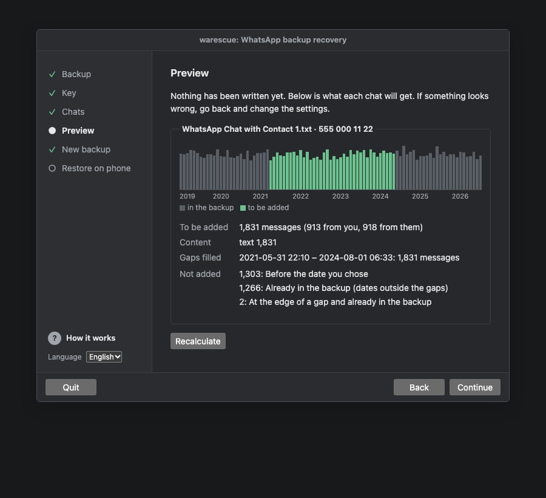
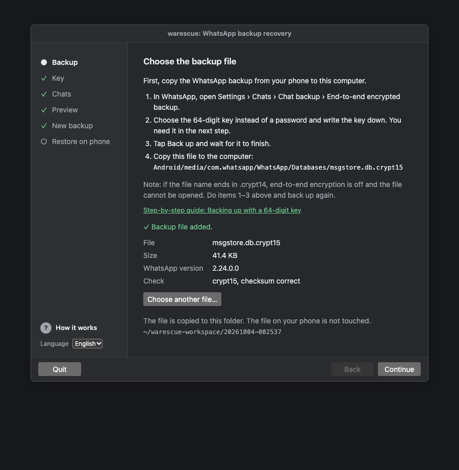
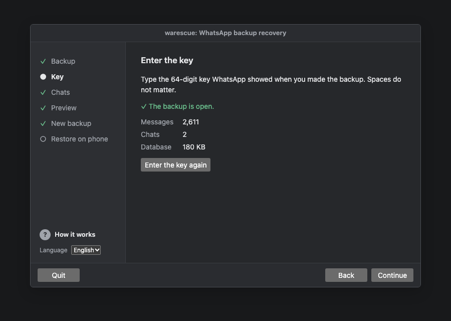
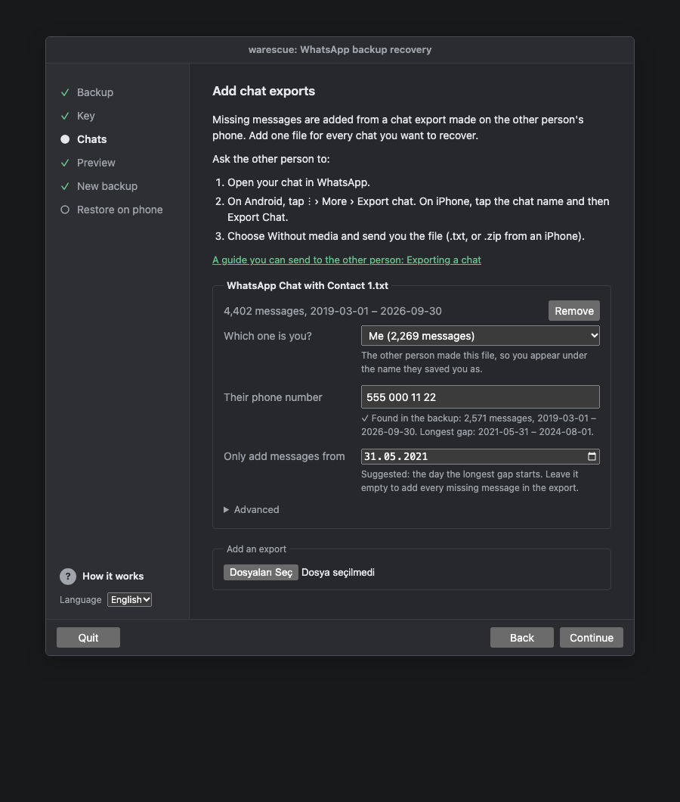
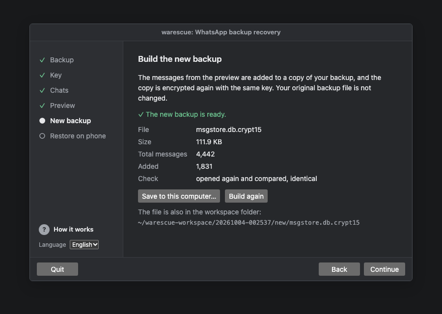
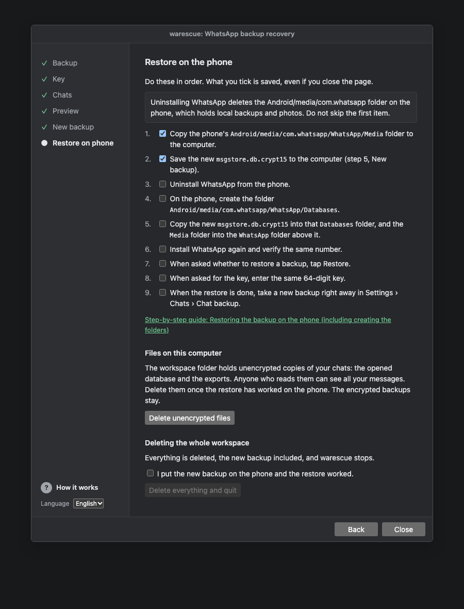
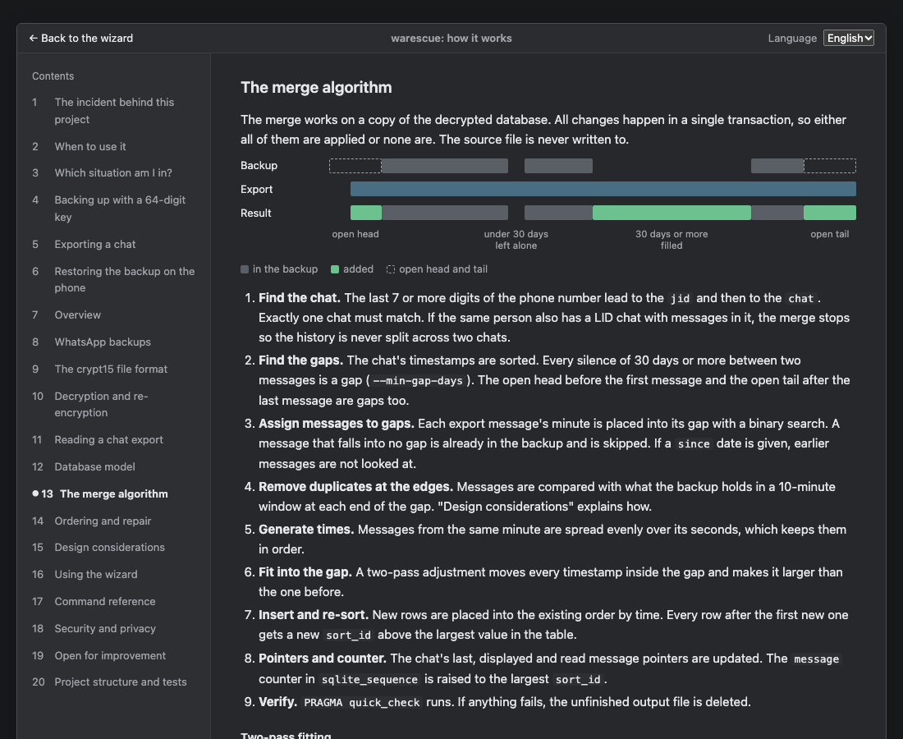

# warescue

**English** · [Türkçe](README.tr.md)

warescue brings back WhatsApp messages that are missing from your phone but still exist on the other person's phone. It opens your own end-to-end encrypted Android backup, adds the missing messages from the other person's chat export, and encrypts the backup again so WhatsApp can restore it. The messages show up inside WhatsApp, in the right place in the chat.

Only the chats you choose are changed. Your other chats and your existing messages are not touched.

Everything in this README is also inside the wizard under **? How it works**, as a page-by-page guide with diagrams.



## Contents

1. [Installation](#installation)
2. [Starting warescue](#starting-warescue)
3. [When to use it](#when-to-use-it)
4. [Which situation am I in?](#which-situation-am-i-in)
5. [Before you start](#before-you-start)
6. [Using the wizard](#using-the-wizard)
7. [Restoring the backup on the phone](#restoring-the-backup-on-the-phone)
8. [Command line](#command-line)
9. [How it works](#how-it-works)
10. [Security and privacy](#security-and-privacy)
11. [Open for improvement](#open-for-improvement)
12. [Contributing and development](#contributing-and-development)
13. [License](#license)

## Installation

You need Python 3.10 or newer and Git. Check your Python version with `python3 --version` (on Windows, `py --version`).

**macOS and Linux**

```bash
git clone https://github.com/sebnembasak/wa-rescue.git
cd wa-rescue
python3 -m venv .venv
source .venv/bin/activate
pip install -e ".[dev]"
warescue --version
```

**Windows (PowerShell)**

```powershell
git clone https://github.com/sebnembasak/wa-rescue.git
cd wa-rescue
py -m venv .venv
Set-ExecutionPolicy -Scope Process -ExecutionPolicy Bypass   # only if activation is blocked
.venv\Scripts\Activate.ps1
pip install -e ".[dev]"
warescue --version
```

Every later command is the same on all systems. When you open a new terminal, activate the virtual environment again with `source .venv/bin/activate` or `.venv\Scripts\Activate.ps1`.

## Starting warescue

```bash
warescue ui
```

The wizard opens in your browser. If it does not, copy the link printed in the terminal into the address bar. The `#t=…` part at the end of the link is the session key, so the page cannot connect without it.

The wizard runs only on your computer. It listens on `127.0.0.1`, loads nothing from the internet and stops when you click **Quit** or after 30 minutes without activity. Working files go to `~/warescue-workspace/<date-time>/`. You can choose another folder with `--workspace`.

The **? How it works** button in the wizard opens a guide with everything below, in Turkish and English.

## When to use it

warescue helps when your conversation with someone is missing on your phone but is still on theirs. Some examples:

- **You deleted a chat on your side.** You deleted the chat with one person and now want it back. Only that chat comes back.
- **You cleared a chat.** The chat is still in the list but empty. The whole history is added back.
- **The restore was skipped.** While reinstalling, "Skip" was tapped instead of "Restore".
- **Your backup is old.** A backup brought history back up to a certain date and everything after that is gone.
- **You changed phones.** The old phone broke or was lost, or the backup could not be moved.
- **The chat history broke.** After an update or a settings change the history would not open and the app was reset.
- **A period is missing.** A chat has a break of several months, for example because another phone was used for a while.
- **The app was uninstalled.** Uninstalling WhatsApp also deleted the local backups, and there was no Google Drive backup.

Good to know:

- If the chat does not appear in the list at all, exchange one message with that person first and then take a backup.
- Individual messages deleted from inside a chat are not added back by default if they fall within a period shorter than 30 days. If you lower this threshold with `--min-gap-days` on the command line, you can recover messages from shorter periods too.
- If the other person has deleted the chat too, there is nothing left to restore from.

## Which situation am I in?

warescue does not need an old backup. Two things are enough. One is any end-to-end encrypted backup taken from your phone. The other is the export of the chat from the other person's phone. The missing messages come from the export. The backup is only the container they are placed into.

**A. I have an old backup.** History came back up to some date and nothing after it.

1. Restore the old backup (see [Restoring the backup on the phone](#restoring-the-backup-on-the-phone)).
2. [Take an end-to-end encrypted backup with a 64-digit key](#backing-up-with-a-64-digit-key).
3. Ask the other person for an [export](#exporting-a-chat) and use the wizard. The missing period goes between two messages or to the end of the chat.

**B. I have no backup at all.** WhatsApp was installed from scratch and every chat is empty.

1. Send a message to each person whose chat you want back, or receive one from them. This puts the chat into the backup.
2. [Take an end-to-end encrypted backup with a 64-digit key](#backing-up-with-a-64-digit-key).
3. Ask the other person for an [export](#exporting-a-chat) and use the wizard. The whole history goes before your new message.

**C. My backup is current but some periods are missing.** A chat has a break of several months.

1. [Take an end-to-end encrypted backup with a 64-digit key](#backing-up-with-a-64-digit-key).
2. Add the [export](#exporting-a-chat). Every break longer than 30 days is filled. The preview shows which periods.

**What you need**

- An Android phone and a computer running Windows, macOS or Linux
- A way to move files between them, such as a USB cable or sending the backup over the internet
- For each chat, the [export file](#exporting-a-chat) the other person sent with "Without media"
- The [64-digit key](#backing-up-with-a-64-digit-key) you chose when making the backup

**When warescue cannot help**

- The other person deleted the chat too, or never had it.
- Group chats are not supported yet.
- Your own phone is an iPhone. Only Android backups can be read. The other person using an iPhone is fine.
- Photos, videos and voice notes are not in the export. A short note is added in their place.

## Before you start

### Backing up with a 64-digit key

warescue can only open end-to-end encrypted backups made with a 64-digit key. Such a backup is called `msgstore.db.crypt15`. The default local backup, `msgstore.db.crypt14`, keeps its key inside the phone and cannot be read without root.

1. In WhatsApp, go to **Settings › Chats › Chat backup**.
2. Tap **End-to-end encrypted backup** and choose **Turn on**.
3. On the password screen, tap **Use 64-digit encryption key instead**. The password option does not work for warescue.
4. Write the key down in a password manager or on paper. If the key is lost, the backup cannot be opened, and WhatsApp cannot recover it either.
5. Tap **Create**, then go back and tap **Back up**.
6. Copy `Android/media/com.whatsapp/WhatsApp/Databases/msgstore.db.crypt15` from the phone to the computer.

If all you have is a crypt14 backup, restore it in WhatsApp first and then follow these steps. The new backup holds the same history as crypt15.

The `Databases` folder may also hold dated files like `msgstore-YYYY-MM-DD.1.db.crypt14`. These are backups from earlier days. To restore one of them, rename it to `msgstore.db.crypt14` and move any other file with that name out of the folder first.

### Exporting a chat

The other person does this on their own phone. You can send them these steps as they are.

**Android**

1. Open the chat with you in WhatsApp.
2. Tap **⋮** at the top right, then **More › Export chat**.
3. Choose **Without media**.
4. Send the file by email, Google Drive or as a document in WhatsApp.

**iPhone**

1. Open the chat with you in WhatsApp.
2. Tap the contact's name at the top of the screen.
3. Tap **Export Chat** and choose **Without Media**.
4. Send the ZIP file by email, iCloud Drive or as a document in WhatsApp.

A file from Android is a `.txt`. A file from an iPhone is a `.zip` containing `_chat.txt`. The wizard accepts both. Do not open or edit the file before adding it. It holds the whole conversation as plain text, so delete it when you are done.

## Using the wizard

| | |
|---|---|
|  |  |
| **1. Backup.** Choose `msgstore.db.crypt15`. The file is copied into the working folder and its layout and checksum are checked. `.crypt14` files are refused with an explanation. | **2. Key.** Enter the 64-digit key. Spaces do not matter. The backup is opened on a copy and the message and chat counts are shown. A wrong key is reported as such. |
|  |  |
| **3. Chats.** Add the exports. For each one, choose which sender is you and type the contact's number. The matching chat is found in the backup right away, and the start of its longest gap is suggested as the "only add messages from" date. | **4. Preview.** Nothing is written yet. Each chat gets a monthly chart of what is already in the backup and what will be added, the gaps that will be filled and why the rest is skipped. |
|  |  |
| **5. New backup.** The messages are added to a copy of the backup and the copy is encrypted with the same key. The result is opened again and compared before you can save it as `msgstore.db.crypt15`. | **6. Restore on phone.** A checklist for the phone. At the end, delete the unencrypted copies of your chats with one button. |

The screenshots use synthetic data. Reloading the page continues at the same step, even while a job is running. Steps 1, 3 and 6 link to the matching part of the guide.

## Restoring the backup on the phone

1. **Back up the media folder.** Copy `Android/media/com.whatsapp/WhatsApp/Media` from the phone to the computer. Uninstalling the app deletes this folder.
2. **Uninstall WhatsApp.**
3. **Create the folders.** On the phone, open `Android/media`. Create a `com.whatsapp` folder if there is none. Inside it create `WhatsApp`, and inside that create `Databases`. The full path must be `Android/media/com.whatsapp/WhatsApp/Databases`.
4. **Put the new backup in place.** Copy the new `msgstore.db.crypt15` into `Databases`. The name must be exactly this, and no other `msgstore` file may be in the folder.
5. **Put the media back.** Copy the saved `Media` folder into the `WhatsApp` folder.
6. **Install WhatsApp** and verify the same phone number. The backup only works with the number it was made with.
7. **Restore.** When the backup is found, tap **Restore** and enter the 64-digit key. If you tap "Skip", the same installation will not ask again.
8. **Take a new backup** as soon as the restore finishes.

The folders can be reached from a computer over USB or with a file manager app on the phone. If something goes wrong, restore your original `msgstore.db.crypt15` the same way.

## Command line

Everything the wizard does is also available as commands. The key is never passed as an argument. It is read from the `WA_BACKUP_KEY` environment variable or from a hidden prompt, so it does not end up in your shell history.

| Command | What it does | Important options |
|---|---|---|
| `inspect` | Shows the file layout, a hex dump and the header tree. Needs no key. | |
| `decrypt` | Turns a crypt15 file into a SQLite database and prints table and message counts. | `--force` |
| `parse` | Summarises an export with its senders, message kinds and date range. | `--me`, `--tz` |
| `merge` | Fills the gaps from an export and writes a new copy. | `--phone`, `--me`, `--out`, `--dry-run`, `--since`, `--min-gap-days`, `--skip-media`, `--tz` |
| `encrypt` | Turns the database back into crypt15 using the original backup as a template, then opens the result to verify it. | `--force` |
| `repair` | Moves messages that ended up mid-chat after a restore to the end and fixes the counter. | `--baseline`, `--out`, `--dry-run` |
| `ui` | Opens the wizard. | `--port`, `--workspace`, `--no-browser` |

Keep your files in a folder named `private` inside the project. It is ignored by git.

```bash
warescue inspect private/msgstore.db.crypt15
warescue decrypt private/msgstore.db.crypt15 private/msgstore.db
warescue parse   private/chats/contact/_chat.txt
warescue merge   private/msgstore.db private/chats/contact/_chat.txt --phone 5551234567 --me "Your Name" --since 2024-10-01 --dry-run
warescue merge   private/msgstore.db private/chats/contact/_chat.txt --phone 5551234567 --me "Your Name" --since 2024-10-01 --out private/merged1.db
warescue encrypt private/merged1.db private/msgstore.db.crypt15 private/out/msgstore.db.crypt15
```

For more than one chat, chain the merges. Each one reads the previous output, for example `private/merged1.db` into `private/merged2.db`.

**`merge` options**

| Option | Meaning |
|---|---|
| `--phone` | The contact's number. The last 7 digits are enough. |
| `--me` | The name you appear under in the export, exactly as `parse` shows it |
| `--since YYYY-MM-DD` | Export messages before this date are ignored. |
| `--min-gap-days N` | Silences shorter than N days are not gaps. The default is 30. |
| `--skip-media` | Media placeholders are not added. |
| `--tz` | Time zone of the phone that made the export. The default is `Europe/Istanbul`. |

**Common error messages**

| Message | What to do |
|---|---|
| `authentication failed` | The key is wrong or the file is crypt14. |
| `expected exactly one chat` | Give more digits in `--phone`. Check that the number belongs to a one-to-one chat. |
| `--me … is not a sender` | Copy the name from the `parse` output exactly, emoji included. |
| `contact also has a LID chat` | The contact has a second chat. This is not supported yet. |
| `export has more than two senders` | It is a group chat, which is not supported. |
| `row ids differ` (repair) | The baseline is not the database the phone was restored from. |

**repair** is for backups merged with versions before 0.2.0, where new messages could end up in the middle of a chat. Take a new backup on the phone, decrypt it, and run `warescue repair <current.db> --baseline <the merged database you restored> --out <fixed.db>`. Then encrypt the result.

## How it works



The full description with diagrams is in the wizard under **? How it works**. In short:

1. **Decrypt.** The 64-digit key goes through HKDF-SHA256 (32 zero bytes as salt, `"backup encryption"` as info). The result opens the AES-256-GCM encrypted body. The IV is read from the protobuf header, and a wrong key is reported as its own error.
2. **Read.** The export is split into messages. Invisible direction marks are removed, and media markers count only when they are the whole message.
3. **Plan.** The chat's gaps are found. Every silence of 30 days or more between two messages is a gap, and so are the open head before the first message and the open tail after the last. Each export message is placed into its gap with a binary search. Within 10 minutes of each gap edge, messages already in the backup are matched by text, or by minute for media, and skipped.
4. **Merge.** Messages from the same minute are spread over its seconds and fitted strictly inside the gap. New rows are merged into the chat's order, renumbered from the first new row, and the AUTOINCREMENT counter is raised so later messages land at the bottom. Everything happens on a copy, in one transaction, and ends with `PRAGMA quick_check`.
5. **Re-encrypt.** The original header is reused with a fresh random IV. The result is decrypted again and compared byte by byte before anything is written.

## Security and privacy

- warescue is not a cracking tool. It only opens your own backup with the key you chose.
- No network requests are made while it runs. The wizard is reachable only from your computer, and every request needs the session key.
- The backup key is never written to disk, never logged and never taken as an argument. The wizard keeps it in memory and wipes it when you quit.
- The decrypted database and the exports hold all your messages in plain text. Delete them when you are done. The last step of the wizard has a button for this. The encrypted `.crypt15` files can be kept.
- `.gitignore` keeps `private/`, `*.crypt1*`, `*.db`, `*.key` and `_chat*.txt` out of git, but not out of other programs on your computer.
- Editing a backup is not something WhatsApp supports. Keep your original files until the result works.
- Everything known about the file format was worked out within this project by examining backups. warescue uses no code from other projects.

## Open for improvement

| Topic | Today | Possible approach |
|---|---|---|
| Search index | Added messages may not show up in WhatsApp search. | Fill the `message_ftsv2` table |
| Media files | Photos and videos appear as placeholder text. | Use exports with media and the `message_media` table |
| Replies and quotes | Exports do not contain this information. | None for now |
| Seconds | Times within a minute are estimated. | None for now |
| Group chats | Not supported. | Map each sender to a `sender_jid_row_id` |
| LID chat with messages | The merge stops for safety. | A way to combine the two chats |
| "Delete for me" | Deleted messages may come back in long gaps. | Limited with `--since` for now |
| Gap threshold in the wizard | Can only be changed on the command line. | Add a setting to the preview step |

## Contributing and development

- Open an issue for a problem or an idea. Describe what you did, what you expected and what happened.
- Send code as a pull request. Every change needs tests. A new behaviour or a fixed bug comes with a test that shows it.
- Tests use synthetic data only. Never share a real backup, export or key. If a bug needs data to show, rebuild it with a synthetic example.
- New export formats or languages are a good place to start. See `src/warescue/chatexport.py` and its tests.

```bash
pytest -q
```

```
src/warescue/
  protowire.py   schema-less protobuf reader and writer
  crypt15.py     file layout, HKDF, AES-GCM, zlib, re-encryption
  chatexport.py  export reader
  merge.py       gap finding, matching, insertion, ordering
  repair.py      ordering repair after a restore
  service.py     operations shared by the command line and the wizard
  cli.py         command line
  ui/            wizard: local server, endpoints, job runner, pages
tests/           synthetic data only
```

### Manual check list for the wizard

Run these in a real browser (Chrome, Firefox and Safari if you can) with synthetic files after changing a page.

- [ ] The page opens from the link `warescue ui` prints, and the address bar no longer shows `#t=…` afterwards.
- [ ] Reloading keeps the current step, also while a decrypt, preview or build is running.
- [ ] Opening the address without `#t=…` in a new tab shows "Not connected" with the start instructions.
- [ ] Step 1 refuses a `.crypt14` file and a random file with a readable explanation, and a large file shows upload progress.
- [ ] Step 2: "Show" reveals the key, the counter reaches 64/64, and a wrong key says so while the form stays usable.
- [ ] Step 3: choosing "me", typing a number and tabbing away keeps focus and typed text. A group chat and an unknown number are explained.
- [ ] Step 4: the chart has a bar per month and a year axis, and hovering a bar shows its counts.
- [ ] Step 5: "Save to this computer…" downloads `msgstore.db.crypt15` and the file decrypts with the same key.
- [ ] Step 6: ticks survive a reload, "Delete unencrypted files" leaves only `.crypt15` files, and "Delete everything and quit" stays disabled until its box is ticked.
- [ ] The guide links in steps 1, 3 and 6 open the right section, and "Back to the wizard" returns to the same step.
- [ ] The language switch changes every text, including messages already on screen.
- [ ] Dark mode and a narrow window (about 400 px) are readable.
- [ ] Every control can be reached with Tab and shows a focus ring.
- [ ] The browser's network panel shows requests to `127.0.0.1` only.

## License

warescue is released under the [MIT License](LICENSE). You may use, change and share it freely as long as the copyright notice stays with it.
