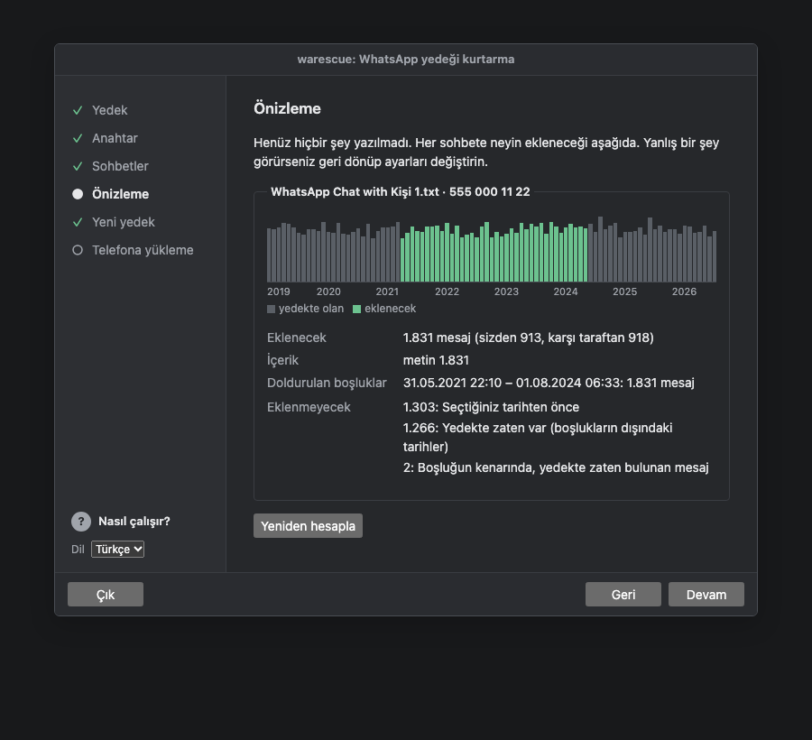
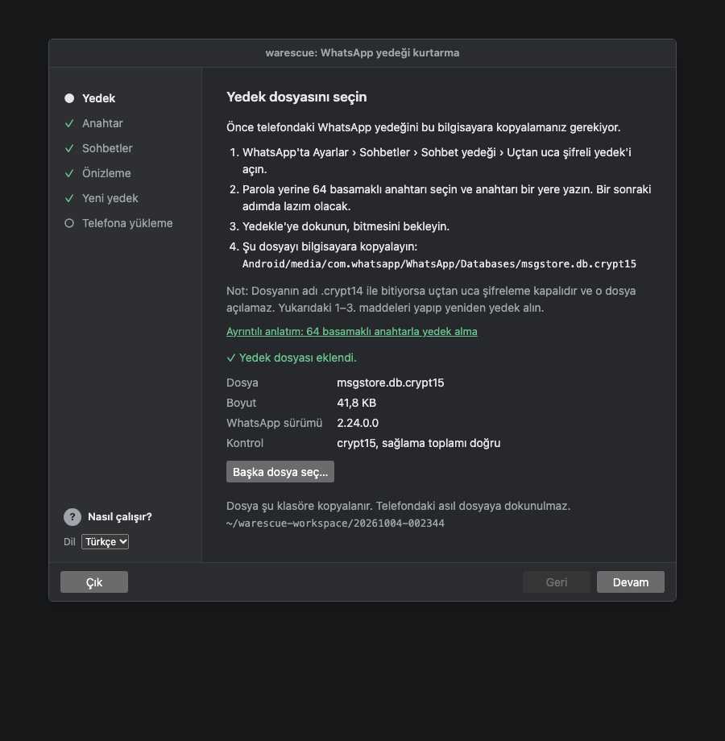
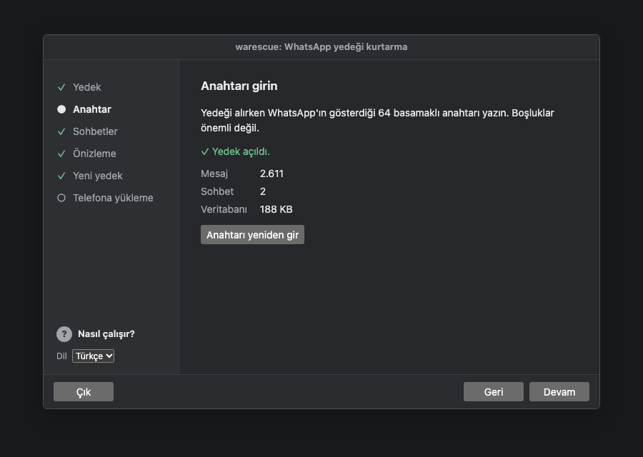
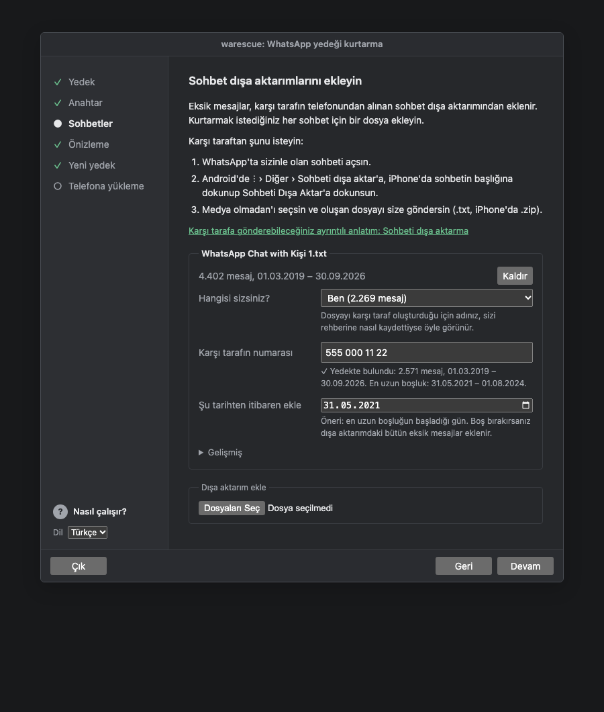
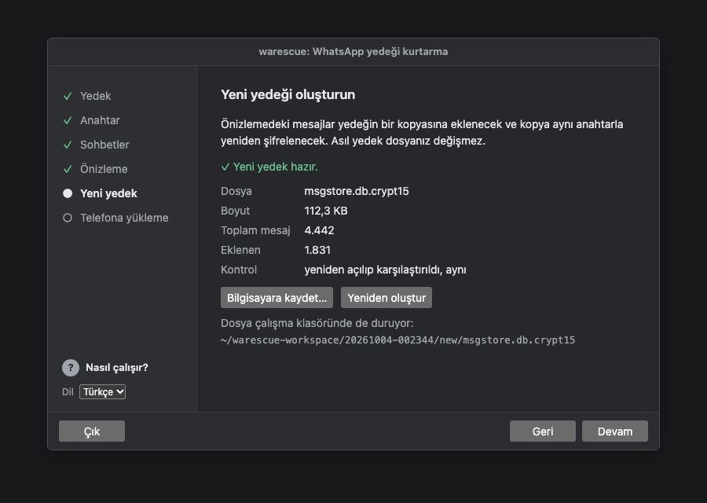
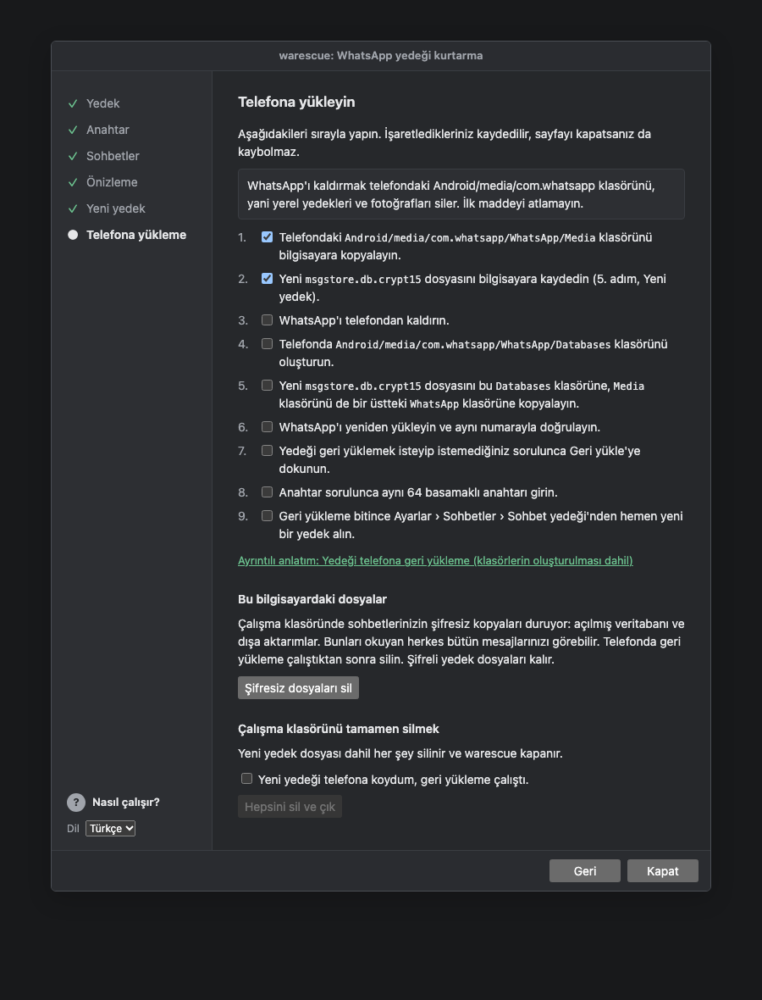
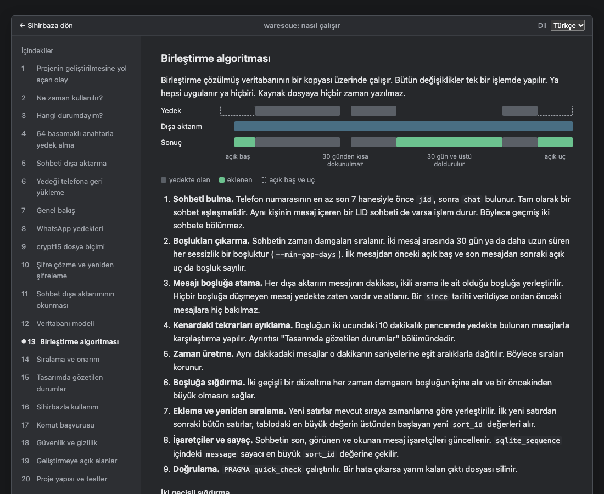

# warescue

[English](README.md) · **Türkçe**

warescue, sizin telefonunuzda eksik olan ama karşı tarafın telefonunda hâlâ duran WhatsApp mesajlarını geri getirir. Kendi uçtan uca şifreli Android yedeğinizi açar, karşı tarafın sohbet dışa aktarımındaki eksik mesajları ekler ve yedeği WhatsApp'ın geri yükleyebileceği şekilde yeniden şifreler. Mesajlar WhatsApp'ın içinde, sohbetteki doğru yerlerinde görünür.

Yalnızca seçtiğiniz sohbetler değişir. Diğer sohbetlerinize ve mevcut mesajlarınıza dokunulmaz.

Bu README'deki her şeyi sihirbazdaki **? Nasıl çalışır?** bölümünde, şemalarla ve bölüm bölüm ilerleyen daha rahat bir arayüzle de okuyabilirsiniz.



## İçindekiler

1. [Kurulum](#kurulum)
2. [warescue'yu başlatmak](#warescueyu-başlatmak)
3. [Ne zaman kullanılır?](#ne-zaman-kullanılır)
4. [Hangi durumdayım?](#hangi-durumdayım)
5. [Başlamadan önce](#başlamadan-önce)
6. [Sihirbazla kullanım](#sihirbazla-kullanım)
7. [Yedeği telefona geri yükleme](#yedeği-telefona-geri-yükleme)
8. [Komut satırı](#komut-satırı)
9. [Nasıl çalışır](#nasıl-çalışır)
10. [Güvenlik ve gizlilik](#güvenlik-ve-gizlilik)
11. [Geliştirmeye açık alanlar](#geliştirmeye-açık-alanlar)
12. [Katkı ve geliştirme](#katkı-ve-geliştirme)
13. [Lisans](#lisans)

## Kurulum

Python 3.10 veya üstü ve Git gerekir. Python sürümünüzü `python3 --version` ile (Windows'ta `py --version`) kontrol edebilirsiniz.

**macOS ve Linux**

```bash
git clone https://github.com/sebnembasak/wa-rescue.git
cd wa-rescue
python3 -m venv .venv
source .venv/bin/activate
pip install -e ".[dev]"
warescue --version
```

**Windows (PowerShell)**

```powershell
git clone https://github.com/sebnembasak/wa-rescue.git
cd wa-rescue
py -m venv .venv
Set-ExecutionPolicy -Scope Process -ExecutionPolicy Bypass   # yalnızca etkinleştirme engellenirse
.venv\Scripts\Activate.ps1
pip install -e ".[dev]"
warescue --version
```

Bundan sonraki bütün komutlar her sistemde aynıdır. Yeni bir terminal açtığınızda sanal ortamı `source .venv/bin/activate` ya da `.venv\Scripts\Activate.ps1` ile yeniden etkinleştirin.

## warescue'yu başlatmak

```bash
warescue ui
```

Sihirbaz tarayıcıda açılır. Açılmazsa terminalde yazan bağlantıyı kopyalayıp adres çubuğuna yapıştırın. Bağlantının sonundaki `#t=…` kısmı oturumun anahtarıdır. Bu kısım olmadan sayfa bağlanamaz.

Sihirbaz yalnızca sizin bilgisayarınızda çalışır. `127.0.0.1` adresini dinler, internetten hiçbir şey yüklemez ve **Çık**'a bastığınızda ya da 30 dakika işlem yapılmadığında kapanır. Çalışma dosyaları `~/warescue-workspace/<tarih-saat>/` klasörüne konur. Başka bir klasör için `--workspace` kullanılabilir.

Sihirbazdaki **? Nasıl çalışır?** düğmesi aşağıdaki her şeyi Türkçe ve İngilizce olarak anlatan bir rehber açar.

## Ne zaman kullanılır?

warescue, bir kişiyle olan yazışmanız sizin telefonunuzda eksik ama onun telefonunda duruyorsa işe yarar. Bazı örnekler:

- **Bir sohbeti kendinizden sildiniz.** Bir kişiyle olan sohbeti sildiniz ve şimdi geri istiyorsunuz. Yalnızca o sohbet geri gelir.
- **Sohbeti temizlediniz.** Sohbet listede duruyor ama içi boş. Bütün geçmiş geri eklenir.
- **Geri yükleme atlandı.** Uygulama yeniden kurulurken "Geri yükle" yerine "Atla" seçildi.
- **Elinizdeki yedek eski.** Yedek belli bir tarihe kadar geri geldi. O tarihten sonrası yok.
- **Telefon değişti.** Eski telefon bozuldu, kayboldu ya da yedek yeni telefona taşınamadı.
- **Sohbet geçmişi bozuldu.** Bir güncelleme ya da ayar değişikliğinden sonra geçmiş açılmadı ve uygulama sıfırlandı.
- **Bir dönem eksik.** Bir sohbette aylarca süren bir kopukluk var. Örneğin bir süre başka bir telefon kullanıldı.
- **Uygulama kaldırılıp kuruldu.** WhatsApp kaldırıldığında telefondaki yerel yedekler de silindi ve Google Drive yedeği yoktu.

Bilinmesi gerekenler:

- Sohbet listede hiç görünmüyorsa önce o kişiyle bir mesajlaşın, sonra yedek alın.
- Sohbetin içinden tek tek silinen mesajlar 30 günden kısa bir aralıktaysa varsayılan ayarla geri eklenmez. Komut satırında `--min-gap-days` ile bu eşiği küçülterek kullanırsanız daha kısa aralıktaki mesajlarınızı da geri kurtarabilirsiniz.
- Karşı taraf da sohbeti silmişse mesajların kaynağı kalmamıştır.

## Hangi durumdayım?

warescue'nun çalışması için eski bir yedek gerekmez. İki şey yeterlidir. Biri telefonunuzdan alınmış herhangi bir uçtan uca şifreli yedek, diğeri karşı tarafın telefonundaki sohbetin dışa aktarımıdır. Eksik mesajlar dışa aktarımdan gelir. Yedek yalnızca onların yerleştirileceği kaptır.

**A. Elimde eski bir yedek var.** Geçmiş bir tarihe kadar geri geldi, sonrası yok.

1. Eski yedeği geri yükleyin ([Yedeği telefona geri yükleme](#yedeği-telefona-geri-yükleme) bölümüne bakın).
2. [64 basamaklı anahtarla uçtan uca şifreli yedek alın](#64-basamaklı-anahtarla-yedek-alma).
3. Karşı taraftan [dışa aktarım](#sohbeti-dışa-aktarma) isteyin ve sihirbazı kullanın. Eksik dönem iki mesajın arasına ya da sohbetin sonuna yerleşir.

**B. Hiç yedeğim yok.** WhatsApp sıfırdan kuruldu ve bütün sohbetler boş.

1. Kurtarmak istediğiniz her kişiye bir mesaj gönderin ya da onlardan bir mesaj alın. Böylece sohbet yedekte yer alır.
2. [64 basamaklı anahtarla uçtan uca şifreli yedek alın](#64-basamaklı-anahtarla-yedek-alma).
3. Karşı taraftan [dışa aktarım](#sohbeti-dışa-aktarma) isteyin ve sihirbazı kullanın. Geçmişin tamamı yeni mesajınızın öncesine yerleşir.

**C. Yedeğim güncel ama bazı dönemler eksik.** Bir sohbette aylarca süren bir kopukluk var.

1. [64 basamaklı anahtarla uçtan uca şifreli yedek alın](#64-basamaklı-anahtarla-yedek-alma).
2. [Dışa aktarımı](#sohbeti-dışa-aktarma) ekleyin. 30 günden uzun her kopukluk doldurulur. Hangi dönemlerin dolduğu önizlemede görünür.

**Gerekenler**

- Android telefon ve Windows, macOS ya da Linux çalışan bir bilgisayar
- Dosyayı telefonla bilgisayar arasında taşımanın bir yolu. USB kablo ya da yedeği internet üzerinden gönderme gibi yöntemler kullanılabilir.
- Her sohbet için karşı tarafın "Medya olmadan" seçeneğiyle gönderdiği [dışa aktarım dosyası](#sohbeti-dışa-aktarma)
- Yedeği alırken seçtiğiniz [64 basamaklı anahtar](#64-basamaklı-anahtarla-yedek-alma)

**warescue'nun yardımcı olamayacağı durumlar**

- Karşı taraf da sohbeti silmişse ya da sohbet onda hiç yoksa.
- Grup sohbetleri henüz desteklenmiyor.
- Kendi telefonunuz iPhone ise. Yalnızca Android yedekleri okunabilir. Karşı tarafın iPhone kullanması sorun değildir.
- Fotoğraf, video ve ses kayıtları dışa aktarımda bulunmaz. Bunların yerine kısa bir not eklenir.

## Başlamadan önce

### 64 basamaklı anahtarla yedek alma

warescue yalnızca 64 basamaklı anahtarla alınmış uçtan uca şifreli yedekleri açabilir. Bu yedeğin adı `msgstore.db.crypt15` olur. Varsayılan yerel yedek olan `msgstore.db.crypt14` dosyasının anahtarı telefonun içinde saklanır ve root olmadan okunamaz.

1. WhatsApp'ta **Ayarlar › Sohbetler › Sohbet yedeği** bölümüne girin.
2. **Uçtan uca şifreli yedek**'e dokunun ve **Aç**'ı seçin.
3. Parola ekranında **Parola yerine 64 basamaklı şifreleme anahtarı kullan** seçeneğine dokunun. Parola seçeneği warescue ile çalışmaz.
4. Anahtarı bir şifre yöneticisine ya da kâğıda yazın. Anahtar kaybolursa yedek açılamaz ve WhatsApp da onu geri getiremez.
5. **Oluştur**'a dokunun, sonra geri dönüp **Yedekle**'ye dokunun.
6. `Android/media/com.whatsapp/WhatsApp/Databases/msgstore.db.crypt15` dosyasını telefondan bilgisayara kopyalayın.

Elinizde yalnızca crypt14 yedek varsa önce onu WhatsApp'a geri yükleyin, sonra bu adımları izleyin. Yeni yedek aynı geçmişi crypt15 olarak içerir.

`Databases` klasöründe `msgstore-YYYY-MM-DD.1.db.crypt14` gibi tarihli dosyalar da bulunabilir. Bunlar önceki günlerin yedekleridir. Birini geri yüklemek için adını `msgstore.db.crypt14` olarak değiştirin. Klasörde aynı adda başka bir dosya varsa önce onu başka bir yere taşıyın.

### Sohbeti dışa aktarma

Bunu karşı taraf kendi telefonunda yapar. Aşağıdaki adımları ona olduğu gibi gönderebilirsiniz.

**Android**

1. WhatsApp'ta sizinle olan sohbeti açın.
2. Sağ üstteki **⋮** menüsüne, ardından **Diğer › Sohbeti dışa aktar**'a dokunun.
3. **Medya olmadan**'ı seçin.
4. Dosyayı e-posta, Google Drive ya da WhatsApp'ta belge olarak gönderin.

**iPhone**

1. WhatsApp'ta sizinle olan sohbeti açın.
2. Ekranın üstündeki kişi adına dokunun.
3. **Sohbeti Dışa Aktar**'a dokunun ve **Medya Olmadan**'ı seçin.
4. ZIP dosyasını e-posta, iCloud Drive ya da WhatsApp'ta belge olarak gönderin.

Android'den gelen dosya `.txt`, iPhone'dan gelen dosya `_chat.txt` içeren bir `.zip` dosyasıdır. Sihirbaz ikisini de kabul eder. Dosyayı eklemeden önce açıp düzenlemeyin. Dosya bütün yazışmayı düz metin olarak içerir, iş bitince silin.

## Sihirbazla kullanım

| | |
|---|---|
|  |  |
| **1. Yedek.** `msgstore.db.crypt15` dosyasını seçin. Dosya çalışma klasörüne kopyalanır, düzeni ve sağlama toplamı kontrol edilir. `.crypt14` dosyaları bir açıklamayla reddedilir. | **2. Anahtar.** 64 basamaklı anahtarı girin. Boşluklar önemli değildir. Yedek bir kopya üzerinde açılır ve mesaj ve sohbet sayısı gösterilir. Yanlış anahtar ayrıca belirtilir. |
|  |  |
| **3. Sohbetler.** Dışa aktarımları ekleyin. Her biri için hangi gönderenin siz olduğunu seçin ve karşı tarafın numarasını yazın. Yedekteki sohbet hemen bulunur ve en uzun boşluğun başladığı gün "şu tarihten itibaren ekle" için önerilir. | **4. Önizleme.** Henüz hiçbir şey yazılmaz. Her sohbet için yedekte olan ve eklenecek mesajları gösteren aylık bir grafik, doldurulacak boşluklar ve geri kalanın neden atlandığı gösterilir. |
|  |  |
| **5. Yeni yedek.** Mesajlar yedeğin bir kopyasına eklenir ve kopya aynı anahtarla şifrelenir. Sonuç tekrar açılıp karşılaştırılır, sonra `msgstore.db.crypt15` olarak kaydedilebilir. | **6. Telefona yükleme.** Telefon için bir kontrol listesi. Sonunda sohbetlerinizin şifresiz kopyalarını tek bir düğmeyle silersiniz. |

Ekran görüntüleri sentetik veriyle alınmıştır. Sayfa yenilense de aynı adımdan devam edilir. Bu, bir iş çalışırken de geçerlidir. 1., 3. ve 6. adımlarda rehberin ilgili bölümüne bağlantı vardır.

## Yedeği telefona geri yükleme

1. **Medya klasörünü yedekleyin.** Telefondaki `Android/media/com.whatsapp/WhatsApp/Media` klasörünü bilgisayara kopyalayın. Uygulamayı kaldırmak bu klasörü siler.
2. **WhatsApp'ı kaldırın.**
3. **Klasörleri oluşturun.** Telefonda `Android/media` klasörüne girin. `com.whatsapp` klasörü yoksa oluşturun. Onun içinde `WhatsApp`, onun içinde de `Databases` klasörünü oluşturun. Tam yol `Android/media/com.whatsapp/WhatsApp/Databases` olmalıdır.
4. **Yeni yedeği yerleştirin.** Yeni `msgstore.db.crypt15` dosyasını `Databases` klasörüne kopyalayın. Adı tam olarak bu olmalıdır ve klasörde başka bir `msgstore` dosyası bulunmamalıdır.
5. **Medyayı geri koyun.** Kaydettiğiniz `Media` klasörünü `WhatsApp` klasörünün içine kopyalayın.
6. **WhatsApp'ı kurun** ve aynı telefon numarasıyla doğrulayın. Yedek yalnızca alındığı numarayla geri yüklenebilir.
7. **Geri yükleyin.** Yedek bulunduğunda **Geri yükle**'ye dokunun ve 64 basamaklı anahtarı girin. "Atla"ya basarsanız aynı kurulumda bir daha sorulmaz.
8. **Yeni bir yedek alın.** Geri yükleme biter bitmez yedek alın.

Klasörlere bilgisayardan USB ile ya da telefondaki bir dosya yöneticisi uygulamasıyla ulaşılabilir. Bir sorun çıkarsa orijinal `msgstore.db.crypt15` dosyanızı aynı yolla geri yükleyebilirsiniz.

## Komut satırı

Sihirbazın yaptığı her şey komutlarla da yapılabilir. Anahtar hiçbir komuta argüman olarak verilmez. `WA_BACKUP_KEY` ortam değişkeninden ya da gizli bir istemden okunur, böylece terminal geçmişine düşmez.

| Komut | Ne yapar | Önemli seçenekler |
|---|---|---|
| `inspect` | Dosya düzenini, onaltılık dökümü ve başlık ağacını gösterir. Anahtar istemez. | |
| `decrypt` | crypt15 dosyasını SQLite veritabanına çevirir ve tablo ve mesaj sayılarını yazar. | `--force` |
| `parse` | Dışa aktarımı özetler. Gönderenleri, mesaj türlerini ve tarih aralığını gösterir. | `--me`, `--tz` |
| `merge` | Boşlukları dışa aktarımdan doldurur ve yeni bir kopya oluşturur. | `--phone`, `--me`, `--out`, `--dry-run`, `--since`, `--min-gap-days`, `--skip-media`, `--tz` |
| `encrypt` | Veritabanını orijinal yedeği şablon alarak crypt15'e çevirir ve sonucu tekrar açarak doğrular. | `--force` |
| `repair` | Geri yüklemeden sonra sohbetin ortasına düşen mesajları sona taşır ve sayacı düzeltir. | `--baseline`, `--out`, `--dry-run` |
| `ui` | Sihirbazı açar. | `--port`, `--workspace`, `--no-browser` |

Dosyalarınızı proje içinde `private` adlı bir klasörde tutun. Bu klasör git tarafından yok sayılır.

```bash
warescue inspect private/msgstore.db.crypt15
warescue decrypt private/msgstore.db.crypt15 private/msgstore.db
warescue parse   private/chats/kisi/_chat.txt
warescue merge   private/msgstore.db private/chats/kisi/_chat.txt --phone 5551234567 --me "Adınız" --since 2024-10-01 --dry-run
warescue merge   private/msgstore.db private/chats/kisi/_chat.txt --phone 5551234567 --me "Adınız" --since 2024-10-01 --out private/merged1.db
warescue encrypt private/merged1.db private/msgstore.db.crypt15 private/out/msgstore.db.crypt15
```

Birden fazla sohbet varsa birleştirmeleri zincirleyin. Her biri bir öncekinin çıktısını okur. Örneğin `private/merged1.db` dosyasından `private/merged2.db` üretilir.

**`merge` seçenekleri**

| Seçenek | Anlamı |
|---|---|
| `--phone` | Karşı tarafın numarası. En az son 7 hane yeterlidir. |
| `--me` | Dışa aktarımda sizin göründüğünüz ad, `parse` çıktısındaki gibi harfi harfine |
| `--since YYYY-MM-DD` | Bu tarihten önceki dışa aktarım mesajlarına bakılmaz. |
| `--min-gap-days N` | N günden kısa sessizlikler boşluk sayılmaz. Varsayılan değer 30'dur. |
| `--skip-media` | Medya yer tutucuları eklenmez. |
| `--tz` | Dışa aktarımı yapan telefonun saat dilimi. Varsayılan değer `Europe/Istanbul`'dur. |

**Sık görülen hata mesajları**

| Mesaj | Ne yapmalı |
|---|---|
| `authentication failed` | Anahtar yanlış ya da dosya crypt14. |
| `expected exactly one chat` | `--phone` için daha fazla hane girin. Numaranın bire bir bir sohbete ait olduğunu kontrol edin. |
| `--me … is not a sender` | Adı `parse` çıktısından, varsa emojisiyle birlikte aynen kopyalayın. |
| `contact also has a LID chat` | Kişinin ikinci bir sohbeti var. Bu durum henüz desteklenmiyor. |
| `export has more than two senders` | Bu bir grup sohbeti ve desteklenmiyor. |
| `row ids differ` (repair) | Referans, telefonun geri yüklendiği veritabanı değil. |

**repair**, 0.2.0 öncesi sürümlerle birleştirilmiş yedekler içindir. O sürümlerde yeni mesajlar sohbetin ortasına düşebiliyordu. Telefonda yeni bir yedek alın, çözün ve `warescue repair <güncel.db> --baseline <geri yüklediğiniz birleştirilmiş veritabanı> --out <düzeltilmiş.db>` komutunu çalıştırın. Ardından sonucu şifreleyin.

## Nasıl çalışır



Şemalarla birlikte ayrıntılı anlatım sihirbazda **? Nasıl çalışır?** altında bulunur. Kısaca:

1. **Şifre çözme.** 64 basamaklı anahtar HKDF-SHA256'dan geçirilir (salt olarak 32 sıfır bayt, bilgi alanı olarak `"backup encryption"`). Sonuç, AES-256-GCM ile şifrelenmiş gövdeyi açar. IV protobuf başlıktan okunur. Yanlış anahtar ayrı bir hata olarak bildirilir.
2. **Okuma.** Dışa aktarım mesajlara ayrılır. Görünmez yön karakterleri temizlenir. Medya işaretleri yalnızca mesajın tamamını oluşturduklarında sayılır.
3. **Planlama.** Sohbetin boşlukları bulunur. İki mesaj arasında 30 gün ya da daha uzun süren her sessizlik bir boşluktur. İlk mesajdan önceki açık baş ve son mesajdan sonraki açık uç da boşluk sayılır. Her dışa aktarım mesajı ikili arama ile ait olduğu boşluğa yerleştirilir. Boşluğun kenarlarındaki 10 dakikalık pencerede yedekte zaten olan mesajlar metne göre, medyada ise dakikaya göre eşleştirilip atlanır.
4. **Birleştirme.** Aynı dakikadaki mesajlar o dakikanın saniyelerine dağıtılır ve boşluğun tam içine sığdırılır. Yeni satırlar sohbetin sırasına yerleştirilir ve ilk yeni satırdan itibaren yeniden numaralanır. AUTOINCREMENT sayacı ilerletilir, böylece sonraki mesajlar en alta düşer. Her şey bir kopya üzerinde ve tek bir işlemde yapılır, sonunda `PRAGMA quick_check` çalışır.
5. **Yeniden şifreleme.** Orijinal başlık rastgele yeni bir IV ile yeniden kullanılır. Sonuç tekrar çözülür ve hiçbir şey yazılmadan önce bayt bayt karşılaştırılır.

## Güvenlik ve gizlilik

- warescue bir kırma aracı değildir. Yalnızca kendi yedeğinizi, kendi seçtiğiniz anahtarla açar.
- Çalışırken hiçbir ağ isteği yapılmaz. Sihirbaza yalnızca kendi bilgisayarınızdan ulaşılabilir ve her istek oturum anahtarını taşımak zorundadır.
- Yedek anahtarı diske yazılmaz, kayıtlara geçmez ve argüman olarak alınmaz. Sihirbaz onu bellekte tutar ve çıktığınızda siler.
- Çözülmüş veritabanı ve dışa aktarımlar bütün mesajlarınızın düz metin halidir. İş bitince silin. Sihirbazın son adımında bunun için bir düğme vardır. Şifreli `.crypt15` dosyaları saklanabilir.
- `.gitignore`, `private/`, `*.crypt1*`, `*.db`, `*.key` ve `_chat*.txt` dosyalarını git'in dışında tutar. Bilgisayarınızdaki diğer programlardan ise saklamaz.
- Yedeği elle değiştirmek WhatsApp'ın desteklediği bir işlem değildir. Sonuç çalışana kadar orijinal dosyalarınızı saklayın.
- Dosya biçimine dair bilgiler bu proje kapsamında, yedekler incelenerek çıkarıldı. warescue başka bir projenin kodunu kullanmaz.

## Geliştirmeye açık alanlar

| Konu | Bugünkü durum | Olası çözüm |
|---|---|---|
| Arama dizini | Eklenen mesajlar WhatsApp aramasında çıkmayabilir. | `message_ftsv2` tablosunun doldurulması |
| Medya dosyaları | Fotoğraf ve videolar yer tutucu metin olarak görünür. | Medyalı dışa aktarımın ve `message_media` tablosunun kullanılması |
| Yanıt ve alıntılar | Dışa aktarımda bu bilgi yoktur. | Şimdilik yok |
| Saniye bilgisi | Saatler dakika içinde tahminidir. | Şimdilik yok |
| Grup sohbetleri | Desteklenmiyor. | Her gönderen için `sender_jid_row_id` eşlemesi |
| Mesaj içeren LID sohbeti | Güvenlik için işlem durur. | İki sohbeti birleştiren bir yöntem |
| "Benden sil" ayrımı | Uzun boşluklarda silinmiş mesajlar geri gelebilir. | Şimdilik `--since` ile sınırlanıyor |
| Sihirbazda boşluk eşiği | Yalnızca komut satırında değiştirilebiliyor. | Önizleme adımına bir ayar eklenmesi |

## Katkı ve geliştirme

- Bir sorun ya da öneri için bir konu (issue) açın. Ne yaptığınızı, ne beklediğinizi ve ne gördüğünüzü yazın.
- Kod katkılarını pull request ile gönderin. Her değişiklik için test yazılmalıdır. Yeni bir davranış ya da düzeltilen bir hata, onu gösteren bir testle birlikte gelir.
- Testler yalnızca sentetik veri kullanır. Gerçek bir yedeği, dışa aktarımı ya da anahtarı hiçbir zaman paylaşmayın. Bir hatayı göstermek gerekirse durumu sentetik bir örnekle yeniden oluşturun.
- Yeni bir dışa aktarım biçimi ya da dil desteği iyi bir başlangıç noktasıdır. `src/warescue/chatexport.py` dosyasına ve testlerine bakın.

```bash
pytest -q
```

```
src/warescue/
  protowire.py   şemasız protobuf okuyucu ve yazıcı
  crypt15.py     dosya düzeni, HKDF, AES-GCM, zlib, yeniden şifreleme
  chatexport.py  dışa aktarım okuyucu
  merge.py       boşluk bulma, eşleştirme, ekleme, sıralama
  repair.py      geri yükleme sonrası sıralama onarımı
  service.py     komut satırı ve sihirbazın ortak işlemleri
  cli.py         komut satırı
  ui/            sihirbaz: yerel sunucu, uç noktalar, iş kuyruğu, sayfalar
tests/           yalnızca sentetik veri
```

### Sihirbaz için elle kontrol listesi

Bir sayfayı değiştirdikten sonra bunları sentetik dosyalarla gerçek bir tarayıcıda (mümkünse Chrome, Firefox ve Safari) deneyin.

- [ ] Sayfa `warescue ui` komutunun yazdığı bağlantıyla açılıyor ve adres çubuğunda sonrasında `#t=…` görünmüyor.
- [ ] Sayfa yenilenince aynı adımda kalınıyor. Şifre çözme, önizleme ya da yeni yedek çalışırken de böyle.
- [ ] Adres `#t=…` olmadan yeni bir sekmede açılınca başlatma adımlarıyla birlikte "Bağlantı yok" ekranı çıkıyor.
- [ ] 1. adım `.crypt14` dosyasını ve rastgele bir dosyayı anlaşılır bir açıklamayla reddediyor. Büyük bir dosyada kopyalama ilerlemesi görünüyor.
- [ ] 2. adımda "Göster" anahtarı gösteriyor, sayaç 64/64'e ulaşıyor ve yanlış anahtar belirtiliyor. Form kullanılabilir kalıyor.
- [ ] 3. adımda "ben" seçilip numara yazılıp Tab ile çıkılınca odak ve yazılan metin kaybolmuyor. Grup sohbeti ve bilinmeyen numara açıklanıyor.
- [ ] 4. adımda grafikte her ay için bir çubuk ve bir yıl ekseni var. Çubuğun üstüne gelince sayıları görünüyor.
- [ ] 5. adımda "Bilgisayara kaydet…" `msgstore.db.crypt15` dosyasını indiriyor ve dosya aynı anahtarla açılıyor.
- [ ] 6. adımda işaretler sayfa yenilense de kalıyor. "Şifresiz dosyaları sil" yalnızca `.crypt15` dosyalarını bırakıyor. "Hepsini sil ve çık" kutusu işaretlenmeden etkinleşmiyor.
- [ ] 1., 3. ve 6. adımlardaki rehber bağlantıları doğru bölümü açıyor. "Sihirbaza dön" aynı adıma geri getiriyor.
- [ ] Dil değiştirince ekrandaki mesajlar dahil her metin değişiyor.
- [ ] Koyu mod ve dar bir pencere (yaklaşık 400 px) okunaklı.
- [ ] Her öğeye Tab ile ulaşılabiliyor ve odak çerçevesi görünüyor.
- [ ] Tarayıcının ağ panelinde yalnızca `127.0.0.1` istekleri var.

## Lisans

warescue [MIT Lisansı](LICENSE) ile yayımlanır. Telif notu korunduğu sürece serbestçe kullanabilir, değiştirebilir ve paylaşabilirsiniz.
